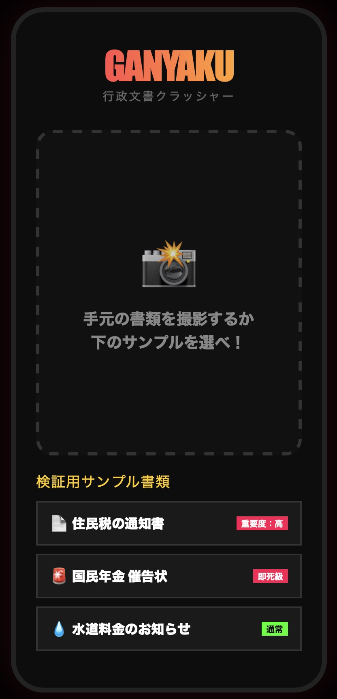

# 📄 お役所書類のバカよけ翻訳機 / Official Document Translator

「お役所の言葉は、なぜこんなに難しいのか？」  
そんな悩みを解決するために、行政文書を「誰にでもわかる言葉」に言い換える「超・無脳（シンプル）」翻訳ツールです。

**URL:** [https://z225t071-ship-it.github.io/my-app-2026/](https://z225t071-ship-it.github.io/my-app-2026/)

## 🚀 使い方 / How to Use

1. **ただ入力するだけ (Just Input)**  
   テキストエリアに、難しい文章をコピー＆ペーストするか、直接入力してください。
2. **瞬時に変換 (Real-time)**  
   ボタンを押す必要はありません。入力した瞬間に、下のエリアに「やさしい言葉」が表示されます。

## ✨ 特徴 / Features

- **超・シンプル (No-brainer)**: 翻訳ボタンを排除。リアルタイムで結果を表示します。
- **多言語対応 (Multilingual)**: 日本語、中国語（簡体字）、韓国語、英語を自動で判別して言い換えます。
- **強調表示**: 変換された箇所が青色で強調され、どこが変わったか一目でわかります。

## 📖 対応言語と例 / Supported Languages & Examples

### 日本語 (Japanese)
- **速やかに** → すぐに
- **遺漏なく** → 漏れがないようにしっかり

### 中国語 (Chinese)
- **请予周知** → 告诉大家
- **抓紧** → 快点

### 韓国語 (Korean)
- **숙지하시기 바랍니다** → 알아두세요
- **신속히** → 빨리

### 英語 (English)
- **In accordance with** → By
- **Utilize** → Use

---
*※本アプリは、あくまで読解の補助を目的としています。正確な法的解釈や指示については、必ず元の書類を確認し、発行元の役所へお問い合わせください。*
